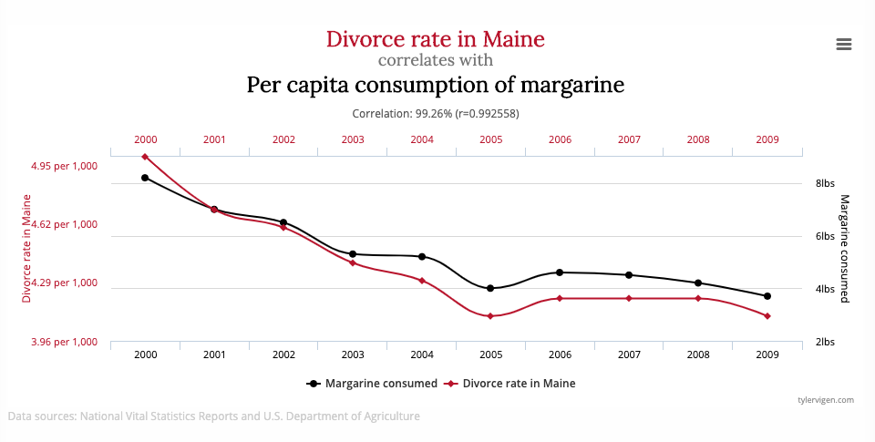

```{=html}
<!-- Comment Section:

Befehl zum Rendern der Seiten: rmarkdown::render_site()

Topics & Todo:

* Idee für zusätzliches Skript: Collider Bias und Selektionseffekte


-->
```
```{r setup, include=FALSE}
knitr::opts_chunk$set(include = FALSE)
library(truncnorm)
library(tidyverse)
```

{style="text-align: center;"}

## Was ist Kausalität?

**Kausalität** \| Lat. *causalitas*: Ursache und Wirkung im Zusammenhang

**Korrelation** \| Lat. *correlatio*: Beziehung zwischen zwei oder mehr Ereignissen

Im Psychologie-Studium hat wahrscheinlich jede Studentin und jeder Student schon einmal das Mantra "Korrelation ≠ Kausalität" gehört. Hier werden wir ein paar häufige Ungenauigkeiten im Gespräch über Korrelation und Kausalität aufklären.

Thomas Cook und Donald T. Campbell formulierten 1979 eine nützliche Definition von Kausalität anhand von drei Bedingungen:

1.  Korrelation: Veränderungen in der angenommenen *Ursache* (unabhängige Variable, UV) müssen in einem systematischen Zusammenhang mit veränderungen in der *Wirkung* (abhängige Variable, AV) stehen.
2.  Zeitliche Abfolge: Die Ursache muss zeitlich *vor* der Wirkung geschehen.
3.  Keine [Konfundierung](https://ctreffe.github.io/r-space/konfundierung.html) durch Alternativerklärungen: Die UV ist der einzige Faktor, der die beobachtete Veränderung in der AV ausgelöst haben kann.

Aus diesen drei Bedingungen kann man direkt ablesen, woher die Kernaussage der Aussage "Korrelation ≠ Kausalität" kommt: Wenn eine Korrelation vorliegt, dann wissen wir dadurch nicht automatisch, ob die anderen beiden Bedingungen für Kausalität auch erfüllt sind. Jede einzelne der drei Bedingungen ist *notwendig* für Kausalität, aber sie sind nur gemeinsam auch *hinreichend* (für eine kurze Erläuterung siehe Wiki: [notwendige und hinreichende Bedingung](https://de.wikipedia.org/wiki/Notwendige_und_hinreichende_Bedingung)).

Schauen wir uns nun zunächst einmal anhand eines Beispiels etwas genauer an, was das bedeutet. Wie Korrelationen trotzdem schon für sich genommen hilfreich bei der Erforschung von Ursache-Wirkungs-Beziehungen sein können, dazu später mehr.

```{r sim, include=FALSE}
set.seed(1234)
ses <- rnorm(n = 100, sd = 1)
ea <- rtruncnorm(n = 100, a = 9, b = 20, mean = 11, sd = 5) + ses
d <- tibble(ses, ea)
```

```{r model}
m1 <- lm(ses ~ ea, data=d)
m1_sum <- m1 %>% summary()
m1_b <- m1_sum$coefficients[2,1] %>% format(nsmall = 2, digits = 2)
m1_ci <- confint(m1)[2,] %>% format(nsmall = 2, digits = 1)
m1_t <- m1_sum$coefficients[2, 3] %>% format(nsmall = 2, digits = 1)
pval <- m1_sum$coefficients[2,4]
if (pval < 0.001) {
  m1_p <- "p < 0.001"
} else {
  m1_p <- paste0("p = ", pval %>% format(nsmall = 3, digits = 3))
}
```

```{r plot}
c_formatted <- cor(ses, ea) %>% 
  format(nsmall = 2, digits = 2)

p <- d %>% ggplot() + 
  aes(x=ea, y = ses) + 
  geom_point() +
  geom_smooth(method="lm", se=F) +
  labs(x = "Bildungsniveau in Jahren", 
       y = "Sozioökonomischer Status im Alter von 40 (z-Werte)") +
  annotate(geom = "label", x = 9, y = 2, 
           label = glue::glue("r = {c_formatted}")) +
  theme_classic()
```

# Beispiel: Bildung und sozioökonomischer Status

### Die Story

Nehmen wir als Beispiel ein fiktives Forschungsprojekt, in der der Zusammenhang von sozioökonomischem Status und Bildungsniveau (gemessen in Jahren im Bildungssystem) untersucht wird. Das Forschungsteam hat eine Vermutug: Je mehr Bildung eine Person genießt, desto höher ist in der Folge ihr sozioökonomischer Status. Sie fragen 100 Menschen im Alter von 40 Jahren, wie viele Jahre sie im Bildungssystem verbracht haben, das beinhaltet z.B. alle Schulformen, Fachhochschulen und Universitäten. Eine Person, die mit 6 Jahren eingeschult wird und mit 26 ihr Studium abschließt hat somit 20 Jahre im Bildungssystem verbracht. Zusätzlich füllen die Befragten eine Skala aus, mit der ihr sozioökonomischer Status eingeschätzt wird.

### Die Analyse

Die Forscher:innen finden einen deutlichen Zusammenhang: Je mehr Jahre Menschen im Bildungssystem verbrachten, desto höher ist ihr sozioökonomischer Status. Pro zusätzlichem Bildungsjahr war der sozioökonomische Status im Mittel um $\beta$ = `r m1_b` Standardabweichungen höher (95 %-Konfidenzintervall: [`r m1_ci[[1]]`, `r m1_ci[[2]]`]), ein hochgradig signifikanter Zusammenhang ($t$ = `r m1_t`, `r m1_p`). Das Forschungsteam sieht die Hypothese bestätigt: Bildung erhöht den sozioökonomischen Status.

```{r print_plot, echo=FALSE, fig.align='center', fig.cap="Abbildung 2: Zusammenhang von Bildungsniveau und sozioökonomischem Status. 'r' gibt die Korrelation an. Simulierte Daten.", message=FALSE, warning=FALSE, include=TRUE, out.width='90%'}
print(p)
```

### Der Haken

Unsere Wissenschaftler:innen waren leider zu voreilig, denn der beschriebene Zusammenhang ist nicht hinreichend für einen Kausalzusammenhang. Gehen wir unsere drei Kriterien von oben einmal durch:

1.  ✅ **Korrelation**: Wir haben eine Korrelation gefunden.

    -   An dieser Stelle besteht trotzdem immer das Risiko eines Typ-1-Fehlers, also eines falsch-positiven Befunds. Eine statistisch signifikante Korrelation kann eben auch Zufall sein.

2.  ❓ **Zeitliche Abfolge**: Wir haben keine Daten über eine zeitliche Abfolge der Variablen vorliegen. Damit kann eine *umgekehrte Kausalrichtung* nicht ausgeschlossen werden. Genau genommen sind drei Szenarien denkbar:

    -   Das Bildungsniveau verursacht Unterschiede im sozioökonomischen Status

    -   Sozioökonomischer Status verursacht Unterschiede im Bildungsniveau. Das kann der Fall sein, falls der sozioökonomische Status über die Lebensspanne weitgehend stabil bleibt - so könnten Kinder aus wohlhabenderen Familien aufgrund ihres höheren soz.-ök.-Status es sich möglicherweise eher leisten, mehr Zeit im Bildungssystem zu verbringen.

    -   Bildungsniveau und sozioökonomischer Status stehen in einer wechselseitigen Ursache-Wirkungs-Beziehung zueinander, d.h. beide sind sowohl Ursache als auch Wirkung: Möglicherweise können Kinder aus wohlhabenderen Familien länger im Bildungssystem bleiben, wodurch sie ihren soziokömomischen Status wiederum weiter verbessern könnten.

3.  ❓ **Alternativerklärungen** sind nicht ausgeschlossen. Damit könnte es sein, dass beide Faktoren durch einen dritten, unbeobachteten Faktor verursacht werden, und dadurch eine Scheinkorrelation entsteht (siehe [Konfundierung](https://ctreffe.github.io/r-space/konfundierung.html)).

### Wie umgehen mit dem Haken?

#### Korrelation als schwacher Test

Auch wenn Korrelation allein keine hinreichende Bedingung für Kausalität ist, können wir uns den Umstand zunutze machen dass sie immerhin eine *notwendige* Bedingung ist: Wenn keine Korrelation vorliegt, dann liegt auch kein Kausalzusammenhang vor. Das bedeutet, wir können Korrelationen durchaus als *schwachen Test* für Theorien und Hypothesen über Kausalität sehen, mit dem wir eine der drei notwendigen Bedingungen für Kausalität überprüfen und eine kausale Theorie falsifizieren können.

::: {.alert .alert-warning}
**Zwei Worte der Vorsicht!**

1.  Damit wir überzeugt sein können, dass ein bestimmter Effekt nicht vorliegt, müssen wir besonderes Augenmerk auf unsere Typ-2-Fehlerrate (auch "Beta-Fehler", im Kontrat zum "Alpha-Fehler"), also den Anteil falsch-negativer Ergebnisse richten. Der häufige Fall einer bloßen nicht-Widerlegung der Nullhypothese (p \> 0.05) ist nur bei hoher *Power* ein wertvoller Hinweis und insgesamt nicht die ideale Methode, um die *Abwesenheit* eines Effekts zu überprüfen. Zum Test der Abwesenheit eines Effekts können *Äquivalenztests* eingesetzt werden (siehe Link unten).
2.  Die statistische Korrelation bildet *lineare* Zusammenhänge ab, in der realen Welt gibt es aber auch *nicht-lineare*, z.B. *exponentielle* Zusammenhänge. Deshalb kann das fehlen einer linearen Korrelation nur lineare Kausalzusammenhänge widerlegen.
:::

#### Was macht einen starken Test aus?

Ein starker Test bezieht alle Bedingungen für Kausalität mit ein:

1.  *Korrelation*: Der statistische Zusammenhang wird überprüft. Typ-1- und Typ-2-Fehlerrate werden kontrolliert.
2.  *Zeitliche Abfolge*: Durch das Studiendesign wird sichergestellt, dass die UV *vor* der AV auftritt, so dass nur eine Kausalrichtung (UV wirkt auf AV) möglich ist. Hierzu dienen bspw. Längsschnittstudien und vorher-nachher-Vergleiche in Experimenten.
3.  *Ausschluss von konfundierenden Alternativerklärungen*: Der "Gold-Standard" ist das randomisierte Experiment (siehe [Konfundierung](https://ctreffe.github.io/r-space/konfundierung.html)). Wenn Randomisierung nicht möglich ist, können theoretisch-logischen Überlegungen und der statistischen Kontrolle von potentiellen konfundierenden Störvariablen genutzt werden.

### Warum ist der Haken wichtig?

Wir betrachten hier kurz sowohl die wissenschaftliche, als auch die Praktiker-Perspektive.

**Wissenschaftliche Perspektive** \| Die wissenschaftliche Perspektive stellt den Erkenntnisgewinn in den Mittelpunkt: Stimmt unsere Theorie?

-   *Ein passendes statistisches Verfahren, bspw. durch Rechnung einer Korrelation oder Kontrolle von potentiellen konfundierenden Störvariablen, ist eine notwendige, aber keine hinreichende Bedingung für einen starken Test von kausalen Theorien.* Das bedeutet, wenn wir einen Datensatz haben, in dem die zweite und dritte Bedingung für Kausalität nicht überprüft werden können, dann können wir dieses Manko nicht durch eine andere rechnerische Analyse kompensieren: Das Studiendesign ist wichtig. Gleichwohl muss auch bei geeignetem Studiendesign natürlich auf die angemessene statistische Analyse geachtet werden.

    -   Eine Korrelation zwischen zwei Variablen ist *konsistent* mit einer kausalen Beziehung zwischen diese Variablen. Wenn keine Korrelation gefunden wird (siehe "Zwei Worte der Vorsicht"), spricht das gegen eine kausale Beziehung.

    -   Eine Korrelation allein ist aber keine überzeugende Evidenz *für* eine Kausalbeziehung oder für *eine bestimmte Richtung* einer Kausalbeziehung. Dafür müssen die zeitliche Abfolge berücksichtigt und Alternativerklärungen ausgeschlossen werden.

-   Das bedeutet: Wenn wir Korrelationen ohne Rücksicht auf das Studiendesign kausal interpretieren, dann riskieren wir falsche Schlussfolgerungen.

**Praktiker-Perspektive** \| Die praktische Perspektive stellt die Nützlichkeit einer aus der Forschung abgeleiteten Intervention in den Mittelpunkt: Sollten wir die Intervention einsetzen?

-   Wenn wir auf Basis rein korrelativer Daten eine Intervention umsetzen, dann kann es sein, dass der gewünschte Effekt ausbleibt: Vielleicht ist die Kausalrichtung eine andere.

-   Solche Daten sollten deshalb nicht als einzige Evidenz zur Bedrüngung von praktischen Entscheidungen verwendet werden. Vielmehr sollten sich Praktiker als Risikomanager:innen verstehen und die theoretische Plausibilität und empirische Evidenz ganzheitlich betrachten. Auf dieser Basis können sie verschiedene Szenarien abwägen und eine bestmöglich fundierte Entscheidung treffen.

-   Dahingehend treffen die gleichen, detaillierteren Überlegungen zu, die wir in unserem Artikel zu [Konfundierung](https://ctreffe.github.io/r-space/konfundierung.html#warum-ist-der-haken-wichtig) (siehe "Warum ist der Haken wichtig?") geschildert haben.

::: {.alert .alert-info}
#### **Studierenden-Perspektive**

Besonders für Studierende ist es wichtig, Kernaussagen prägnant zusammenfassen zu können.

**Frage**: Die Autoren berichten von einer Korrelation zwischen Bildungsjahren und sozioökonomischem Status und werten das als Evidenz für ihre Theorie, dass mehr Bildung zu einem höheren sozioökonomischen Status führt. Wie bewerten Sie die Evidenz?

**Mögliche Antwort**: Zunächst einmal ist die Korrelation konsistent mit der Theorie. Allerdings kann durch die bloße Berechnung einer Korrelation in dem berichteten Querschnittsdesign weder die umgekehrte Kausalrichtung ausgeschlossen werden, noch können konfundierende Einflüsse von Drittvariablen ausgeschlossen werden. Deshalb handelt es sich allenfalls um einen schwachen Test der Theorie, die Evidenz ist nicht hinreichend für die Schlussfolgerung.

**Frage**: Würden Sie auf Basis dieser Ergebnisse zusätzliche Investitionen ins Bildungsystem befürworten?

**Mögliche Antwort**: Diese konkrete Evidenz ist nicht eindeutig und daher keine gute Entscheidungsgrundlage. Die Frage nach Investitionen ins Bildungssystem sollte allerdings mit einem größeren Horizont betrachtet werden: Es gibt durchaus plausible Gründe anzunehmen, dass Investitionen in Bildung von Nutzen sind. Der Umstand, dass die korrelative Evidenz unbefriedigend ist, kann keineswegs als Beleg des Gegenteils gelten.
:::

## Literatur und Links

-   Cook, Thomas D., and Donald T. Campbell. *Quasi-Experimentation: Design & Analysis Issues for Field Settings*. Houghton Mifflin Company, Boston 1979.

-   **Äquivalenztests**: Lakens, D., Scheel, A. M., & Isager, P. M. (2018). Equivalence Testing for Psychological Research: A Tutorial. Advances in Methods and Practices in Psychological Science, 1(2), 259--269. <https://doi.org/10.1177/2515245918770963>
