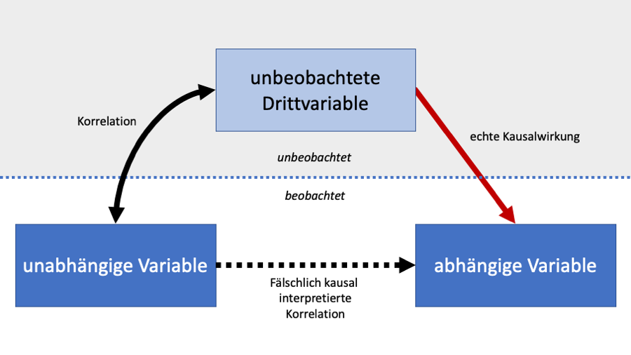

```{r setup, include=FALSE}
knitr::opts_chunk$set(echo = FALSE)
```

```{r packages, message=FALSE, warning=FALSE}
# Pakete für diesen Artikel
library(tidyverse)
library(truncnorm)
```

```{r datasim}

set.seed(12345) # seed for reproducibility of random numbers

t1_sunhours <- rnorm(n = 60, mean = 3)
t2_sunhours <- rnorm(n = 60, mean = 6.5)

# simulate BDI scores at time 1
t1_bdi <- round(t1_sunhours + rtruncnorm(n = 60, a = 3, b = 60, m = 37, sd = 10), 0) 

# simulate BDI scores at time 2, which are on average 5 points smaller than at time 1
t2_bdi <- round(t1_bdi - t2_sunhours + rnorm(n = 60, sd = 3), 0)

# wrap in a data frame
d <- tibble(t1_bdi, t2_bdi, t1_sunhours, t2_sunhours) %>% 
  
  mutate(id = 1:n()) %>% 
  mutate(group = rep(c("treatment", "control"), each = 30)) %>% 
  
  pivot_longer(t1_bdi:t2_sunhours, 
               names_to=c("time", ".value"), 
               names_pattern="(.*)_(.*)") %>%
  
  mutate(time = factor(time, labels = c("pre", "post")))
  
  

# subset: only subjects in treatment group
treated <- d %>% filter(group == "treatment")

# summarised data with difference
diff_data <- d %>% 
  select(-sunhours) %>% 
  pivot_wider(values_from=bdi, names_from=time) %>% 
  mutate(bdi_change = post - pre)
```

```{r model1}
m1 <- lm(bdi ~ time, data = treated)
m1_sum <- summary(m1)

beta <- m1$coefficients[[2]] %>% round(2)
beta_ci <- confint(m1)[2,] %>% round(2)
beta_p <- m1_sum$coefficients[[2,4]] %>% round(3)
```

```{r plot, warning=FALSE}
# Plot
plot <- treated %>% 
  ggplot(aes(x = time, y = bdi, fill = time)) +
  
  # Balken mit Mittelwerten
  stat_summary(fun = "mean", geom = "bar") +
  
  # Darstellung von Standardabweichungen
  stat_summary(fun.data = "mean_sdl", fun.args = list(mult = 1), 
               geom = "pointrange", width = 0.15) +
  
  stat_summary(fun.data = "mean_cl_boot", 
               geom = "errorbar", linetype = "dotted", color = "grey20") +
  
  # Beschriftungen und Layout
  labs(x = "Messzeitpunkt", 
       y = "mittlerer BDI Summenscore") +
  
  scale_x_discrete(labels = c("Vorher", "Nachher")) +
  guides(fill = FALSE) +
  theme_classic()
```

```{r model2}
# using full sample, dv: change in BDI score (post - pre)
m2 <- lm(bdi_change ~ group, data = diff_data)
m2_sum <- m2 %>% summary()
```

```{r model3}
# statistical control of confounder
m3 <- lm(bdi ~ time + sunhours, data = treated)
m3_sum <- m3 %>% summary()
```

## Was ist Konfundierung?

**Konfundierung** \| Lat. *confundere*: Verwechseln, vermischen, zusammengießen

Konfundierung ist ein besonders folgenreicher Fall von irreführenden Daten. Sie liegt vor, wenn wir einen Zusammenhang zwischen zwei Variablen beobachten, der eigentlich auf eine dritte Variable zurückzuführen ist, die wir nicht berücksichtigt haben. Im Detail ist Konfundierung durch folgende Aspekte gekennzeichnet:

1.  Unsere unabhängige Variable korreliert mit einer dritten Variable, die wir in der Analyse nicht berücksichtigt haben.
2.  Diese dritte Variable verursacht Veränderungen in der abhängigen Variable.
3.  Durch die Punkte (1) und (2) finden wir einen Zusammenhang (z.B. Korrelation) zwischen unserer unabhängigen und unserer abhängigen Variable.

Wenn wir nun aus dem Zusammenhang, bzw. der Korrelation der unabhängigen und der abhängigen Variable schließen, dass die unabhängige Variable Änderungen in der abhängigen Variable *verursacht* (d.h. dass sie einen *kausalen* Einfluss hat), dann unterliegen wir einem Irrtum.

{style="text-align: center;" width="750"}

## Beispiel: Die Emotions-Ablösungs-Therapie

{style="float: left; margin-right: 1rem;" width="200"}

### Die Story

Nehmen wir einmal an, wir möchten die Wirkung einer neuen Psychotherapiemethode testen. Die Methode, um die es geht, ist die (fiktive) sogenannte "Emotions-Ablösungs-Therapie". Sie funktioniert so: Patient:innen mit schwerer klinischer Depression ziehen sich zu Beginn einer Therapiesitzung einen schweren Mantel an. Während der Sitzung lassen die Patient:innen insbesondere ihren negativen Emotionen freien Lauf. Dabei stellen die Patient:innen sich vor, wie sie ihre Emotionen in den Mantel abgeben. Am Ende der häufig sowohl für Therapeut:in, als auch für Patient:in sehr anstrengenden Sitzung, wird der Mantel und damit die negative Emotionalität einfach abgelegt.

Ein norwegisches Forschungsteam hat kürzlich eine Pressekonferenz abgehalten, in der sie von vielversprechenden Ergebnissen einer ersten Studie berichten. Nach einem 12-wöchigen experimentellen Therapieprogramm in der Wartezeit auf einen herkömmlichen Therapieplatz wiesen die Teilnehmenden deutlich geringere Werte in Becks Depressions-Inventar auf, als vor der Therapie.

### Die Analyse

Hier zunächst ein Blick auf die Daten der ersten beiden Versuchspersonen. Die Spalte `id` enthält eine Zahl zur identifizierung der Versuchsperson, `time` zeigt den Messzeitpunkt ("pre" = vor der Behandlung, "post" = nach der Behandlung) und `bdi` enthält den BDI-Summenscore, der Versuchsperson zum jeweiligen Zeitpunkt. Es gibt zwei Zeitpunkte und daher bei diesem Datenformat ("long" Format genannt) zwei Zeilen pro Person.

```{r echo=FALSE}
d %>% select(-sunhours, -group) %>% print(n=4)
```

Das Forschungsteam analysierte die Daten mit einer einfachen linearen Regression (in diesem Fall äquivalent zum t-Test). Hier die Ergebnisse:

```{r echo=FALSE}
m1_sum
```

Der Unterschied zwischen prä- und post-Messung ist erheblich: Der BDI-Summenscore war im Mittel nach der Behandlung um ganze `r beta` Punkte geringer als vorher (95 %-Konfidenzintervall: [`r beta_ci[[1]]`, `r beta_ci[[2]]` ]). Der Unterschied ist auch in der grafischen Darstellung deutlich zu sehen:

```{r echo=FALSE, out.width='90%', fig.align='center', fig.cap="**Abbildung**: Wirkung der Emotions-Ablösungs-Therapie.\nFehlerbalken zeigen plus/minus eine Standardabweichung im BDI score um den Mittelwert.\nGepunktete Linien zeigen 95%-Konfidenzintervalle für die Mittelwerte."}
plot
```

### Der Haken

Was ist nun der Haken an dieser Analyse? Der Haken ist: Die Datenerhebung begann im Winter und endete im Frühling. Im Winter gibt es, gerade in nördlichen Breitengeraden, nur sehr wenige Stunden Sonnenlicht pro Tag. Das kann das Befinden von Menschen erheblich beeinflussen. So bilden viele Menschen in nördlichen Ländern eine sogenannte Winterdepression aus. Sobald es wieder mehr Sonnenlicht gibt, fühlen sich die Menschen wieder besser. Gehen wir einmal die Checkliste von oben durch:

1.  Unsere unabhängige Variable (Zeipunkt der BDI-Messung, prä/post) korreliert mit einer dritten Variable, die wir in der Analyse nicht berücksichtigt haben: Die prä-Messung fand im Winter, die post-Messung im Frühling statt.
2.  Diese dritte Variable verursacht Veränderungen in der abhängigen Variable: Im Winter gibt es wegen der Sonneneinstrahlung generell hohe BDI-Werte, im Frühling geringere.
3.  Durch die Kombination von (1) und (2) scheint es in unserer naiven Analyse so, als würden die Daten für die Wirksamkeit der Therapie sprechen. (Hier wissen wir: Das ist ein Fehlschluss. In der Realität wissen wir das oft nicht.)

### Warum ist der Haken wichtig?

Wir betrachten hier kurz sowohl die wissenschaftliche, als auch die Praktiker-Perspektive, und unterscheiden zwei Szenarien:

1.  Wir sind unsicher, ob Konfundierung vorliegt. Das ist der Fall, wenn wir Konfundierung durch unser Forschungsdesign nicht ausschließen können, z.B. weil wir einfach keine Kontrollgruppe haben, die wir mit unserer Experimentalgruppe vergleichen. Wir können dann schlicht nicht wissen, ob Konfundierung vorliegt, selbst wenn wir keine Vermutung haben, welche Einflüsse möglicherweise zu Konfundierung führen könnten.
2.  Wir haben Hinweise auf Konfundierung. Das ist der Fall, wenn wir (1) Konfundierung durch nicht ausschließen können und (2) es darüber hinaus zusätzlich Informationen gibt, die auf Konfundierung hindeuten. So ein Hinweis könnte z.B. eine plausible Alternativerklärung oder eine Ungereimtheit in der statistischen Analyse sein. Die Winterdepressions-Erklärung aus dem Beispiel oben ist eine solche plausible Alternativerklärung.

**Wissenschaftliche Perspektive \|** Die wissenschaftliche Perspektive stellt den Erkenntnisgewinn in den Mittelpunkt: Stimmt unsere Theorie? Wie groß und wie zuverlässig ist der Effekt? Welche Faktoren beeinflussen das Ergebnis?

-   Wenn in einer Studie eine Alternativerklärung für das gefundene Ergebnis durch eine konfundierende Drittvariable nicht ausgeschlossen werden kann, dann handelt es sich bei dieser Studie nicht um einen *geeigneten Test* der untersuchten Theorie oder Hypothese.
-   Das heißt nicht notwendigerweise, dass die Theorie oder Hypothese durch die Studie widerlegt wird - sie wurde einfach nicht richtig getestet. Sie bietet per se erst einmal keine gute Evidenz.
-   Wenn wir darüber hinaus Hinweise auf Konfundierung haben, und diese Konfundierug den gesamten Effekt erklären kann, dann kann die Studie als Evidenz gegen die Theorie/Hypothese interpretiert werden. Man sollte trotzdem meistens vorsichtig mit einem starken Urteil sein und lieber zusätzliche Studien mit experimenteller Kontrolle für Konfundierung durchführen.

**Praktiker-Perspektive** \| Die praktische Perspektive stellt die Nützlichkeit einer aus der Forschung abgeleiteten Intervention in den Mittelpunkt: Sollten wir die Intervention einsetzen? Wie überzeugt sind wir insgesamt von der Evidenz für oder gegen die Wirksamkeit der Intervention? Wie ist das Kosten-Nutzen-Verhältnis? Diese Fragen werden durch die wissenschaftliche Perspektive unterfüttert. Es kann dabei auch um generelle Handlungsempfehlungen gehen, nicht nur um ganz konkret umrissene Interventionen.

-   Wenn eine Konfundierung nicht ausgeschlossen werden kann (und die konfundierte Studie die einzige verfügbare Evidenz ist), dann kann es sein, dass der vermutete/gefunde Effekt in Wirklichkeit nicht existiert. Das hat praktische Konsequenzen.

-   Praktiker sollten dennoch nicht einfach dem Schema folgen, dass wirksame Interventionen umgesetzt werden und nicht eindeutig wirksame Interventionen nicht umgesetzt werden. Sie müssen stattdessen als Risikomanager:innen handeln und die möglichen positiven und negativen Konsequenzen ihrer Entscheidung ganzheitlich abwägen.

-   Dafür eignet sich die Abwägung anhand einer vier-Felder-Tafel, die vier Situationen aufzeigt (siehe unten). Für jede dieser Situationen müssen die folgenden Fragen beantwortet werden:

    -   Welche Kosten (finanzielle und Opportunitätskosten) entstehen durch diese Entscheidung?
    -   Welche positiven Effekte könnten durch diese Entscheidung eintreten?
    -   Welche negativen Effekte könnten durch diese Entscheidung eintreten?
    -   Wie groß, bzw. wichtig sind die möglichen positiven und negativen Effekte?
    -   Wie wahrscheinlich sind die jeweiligen positiven oder negativen Effekte? Hier sollten die Gesamtheit der empirischen Evidenz, die Theorie über den Wirkmechanismus und praktische Erfahrung einfließen.

-   Auf dieser Grundlage kann eine praktische Entscheidung getroffen werden. Das kann unter Umständen auch bedeuten, dass es angemessen ist, Interventionen mit guter Evidenz **nicht** umzusetzen, dafür aber andere Interventionen mit schlechter Evidenz **umzusetzen**.

+-----------------------------+---------------------------------------------------------------------+-------------------------------------------------------------------------------+
| /                           | Intervention umgesetzt                                              | Intervention nicht umgesetzt                                                  |
+=============================+=====================================================================+===============================================================================+
| Theorie **trifft zu**       | (1) Intervention auf Basis zutreffender Theorie umgesetzt           | (2) Intervention auf Basis zutreffender Theorie **nicht** umgesetzt           |
+-----------------------------+---------------------------------------------------------------------+-------------------------------------------------------------------------------+
| Theorie **trifft nicht zu** | (3) Intervention auf Basis **nicht** zutreffender Theorie umgesetzt | (4) Intervention auf Basis **nicht** zutreffender Theorie **nicht** umgesetzt |
+-----------------------------+---------------------------------------------------------------------+-------------------------------------------------------------------------------+

### Was tun gegen Konfundierung?

-   **Das randomisierte Experiment** \| Glücklicherweise gibt es eine wahre Wunderwaffe gegen Konfundierung: Das randomisierte Experiment. Wir teilen dabei unsere Versuchspersonen zufällig in eine **Kontroll- und eine Experimentalgruppe** ein. Die beiden Gruppen unterscheiden sich ausschließlich darin, dass in der Experimentalgruppe die untersuchte Intervention durchgeführt wird, während die Kontrollgruppe als Vergleichgröße dient, mit der der Einfluss von Drittvariablen konstant gehalten wird. Im Falle von Interventionen muss besonders aufgepasst werden, dass durch die Kontrollgruppe auch ein möglicher *Placebo*-Effekt kontrolliert wird. So können wir schließlich die Entwicklung in beiden Gruppen miteinander vergleichen den Effekt unserer Intervention identifizieren.

-   **Statistische Kontrolle** \| Zufällige Zuteilung zu Experimentalgruppen ist nicht immer möglich, beispielsweise wenn man Unterschiede zwischen Männern und Frauen untersuchen möchte. In diesen Fällen können wir unsere Datenanalyse verbessern, indem wir bspw. mögliche konfundierende Drittvariablen in einer Regressionsanalyse explizit als Kovariaten mit aufnehmen. Theoretisch kann so die Verzerrung der Analyse behoben werden. Doch *Vorsicht*: Die statistische Kontrolle ist weniger sicher als das randomisierte Experiment. Insbesondere können diese Probleme die Analyse verzerren:

    -   **Unvollständige Kontrolle** \| Wenn es konfundierende Drittvariablen gibt, die wir in unserer Analyse nicht berücksichtigen, kann deren verzerrender Einfluss auf das Ergebnis nicht entfernt werden. Das kann zum Beispiel der Fall sein, wenn wir solche Drittvariablen vergessen, oder aber wenn es für uns schlicht nicht möglich ist, sie zu messen.

    -   **Collider** \| Es gibt noch eine andere Art von Drittvariable, sogenannte *Collider*. Sie sind die weniger bekannten Zwillinge der konfudierenden Drittvariablen und funktionieren genau umgekehrt: Ein Collider verzerrt unsere Ergebnisse, *wenn wir ihn in die statische Analyse aufnehmen*. Collider sind Variablen, die durch die unabhängige und die abhängige Variable gemeinsam verursacht werden. Wie genau das funktioniert, ist in diesem (englischen) Blog-Post schön beschrieben: [That one weird third variable problem nobody ever mentions: Conditioning on a collider](http://www.the100.ci/2017/03/14/that-one-weird-third-variable-problem-nobody-ever-mentions-conditioning-on-a-collider/)

## Beispiel aus der Wissenschaft
