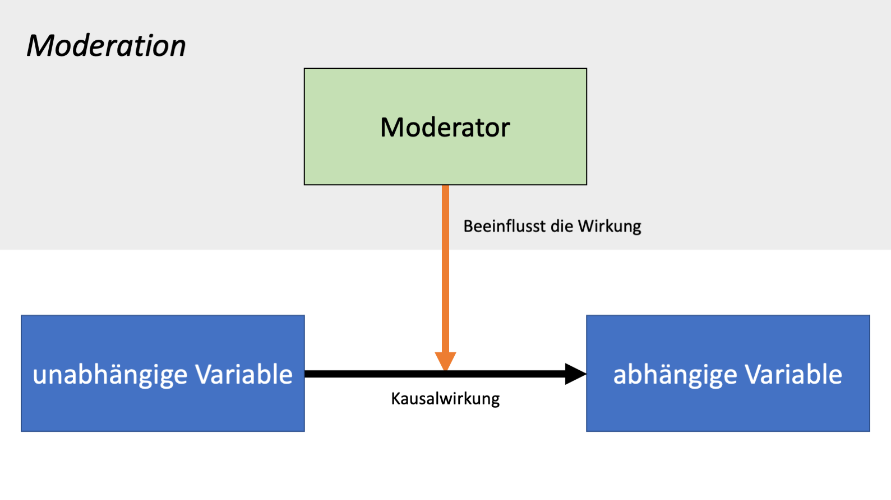
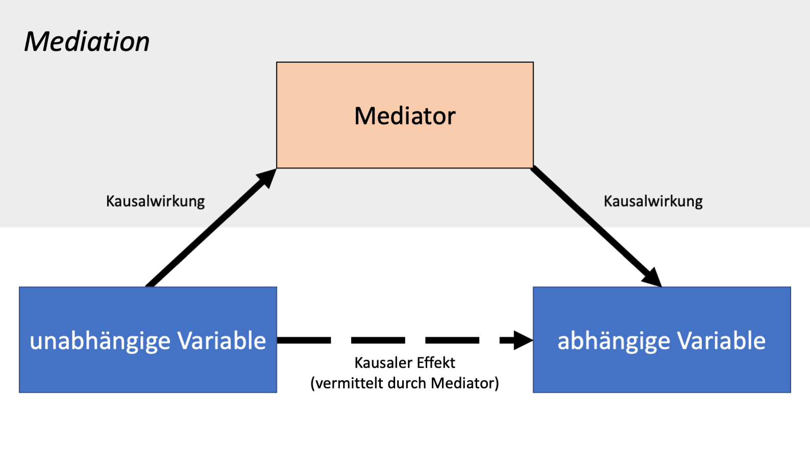
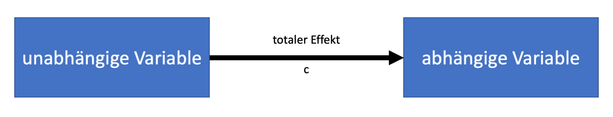
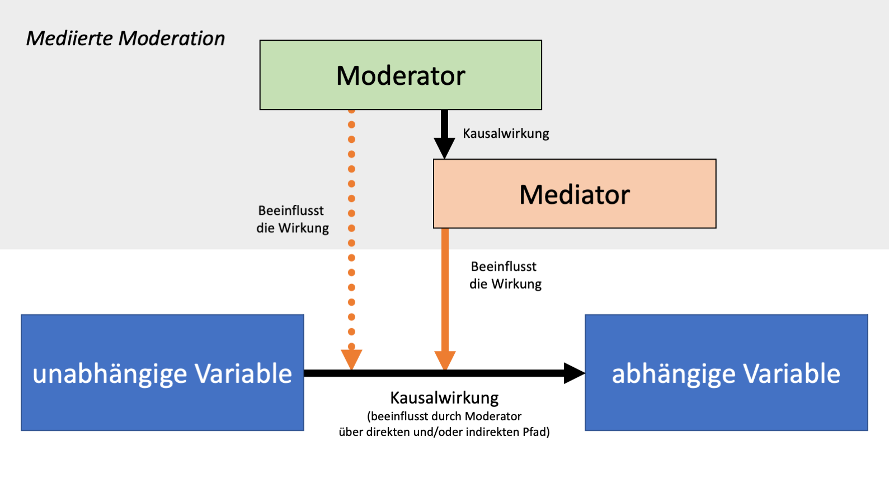

```{r setup, include=FALSE}
knitr::opts_chunk$set(echo = FALSE, message=FALSE, warning=FALSE, fig.align="center")
library(tidyverse)
```

## Was ist Moderation, was ist Mediation?

In diesem Skript erklären wir die beiden Konzepte *Moderation* und *Mediation*. In der psychologischen Forschung begegnen uns diese beiden Konzepte häufig, und es ist wichtig, sie ihre Bedeutung und die Unterschiede zwischen ihnen zu verstehen. Wir stützen uns dabei auf eine klassische Forschungsarbeit von Baron & Kenny (1986), in der die Autoren die Konzepte und Analysestrategien erklären. Wir werden hier zunächst beide Konzepte kurz inhaltlich erklären und dann separat anhand von Beispielen auf wichtige Details eingehen. Fangen wir mit der Moderation an.

### Moderation

Baron & Kenny definieren einen Moderator wie folgt:

**Moderator |** „In general, a moderator is a qualitative (e.g. sex, race, class) or quantitative (eg., level of reward) variable that affects the direction and/or strength of the relation between an independent or predictor variable an a dependent or criterion variable.“ (Baron & Kenny, 1986)

Das bedeutet, ein Moderator *verändert* den Einfluss, den eine unabhängige Variable (UV) auf eine abhängige Variable (AV) hat. Wenn wir Moderation untersuchen, dann wollen wir herausfinden, warum eine unabhängige Variable situationsabhängig unterschiedliche Wirkung hat. Das können wir uns mit einem Schaubild weiter verdeutlichen:

```{r, fig.cap="Abbildung 1. Schematische Darstellung einer Moderation.", out.width = "80%"}

```

### Mediation

Wir zitieren zunächst wieder die Definition von Baron & Kenny:

**Mediator |** „In general, a given variable may be said to function as a mediator to the extent that it accounts for the relation between the predictor and the criterion.“ (Baron & Kenny, 1986)

Das bedeutet, ein Mediator *vermittelt* den Einfluss, den eine unabhängige Variable auf eine abhängige Variable hat. Wir könnten sagen, die unabhängige Variable *wirkt durch den Mediator*: Die UV wirkt kausal auf den Mediator, und der Mediator wirkt kausal auf die AV. Wenn wir Mediation untersuchen, dann wollen wir herausfinden, *wie genau* die Wirkung einer unabhängigen Variable auf eine abhängige Variable zustande kommt. Auch das können wir uns mit einem Schaubild weiter verdeutlichen:

```{r, fig.cap="Abbildung 2. Schematische Darstellung einer Mediation.", out.width = "80%"}

```

### Abgrenzung von Moderation und Mediation

<div class="alert alert-info">
Im Fall von **Moderation** interessieren uns Veränderungen in der Wirkung einer UV auf eine AV.

Im Fall von **Mediation** interessiert uns der Mechanismus, über den eine UV auf eine AV wirkt.
</div>


## Mehr über Moderation

### Vorgehen bei der Analyse von Moderationseffekten

Eine Moderation wird in der Regel über die Aufnahme von *Interaktionstermen* in statistischen Modellen analysiert. Das generelle Vorgehen umfasst die Beantwortung von zwei Fragen:

1. **Liegt eine Interkation vor?** Hier wird zunächst getestet, ob der Interaktionsterm des Modells überhaupt signifikant verschieden von 0 ist.

2. **Wie sieht die Interaktion aus?** Diese Frage stellt sich nur, wenn Frage 1 mit "Ja" beantwortet wird. Der Schritt wird in der Fachsprache häufig als *probing the interaction* benannt. 

  + Ein häufiger Fall ist die Analyse von *zweifaktoriellen Designs*. Dabei sind sowohl die UV als auch der Moderator dichotome Variablen, haben also nur jeweils zwei Ausprägungen. In diesem Fall unterscheidet man *ordinale*, *semi-disordinale* und *disordinale* Interaktionen. Eine anschauliche Erklärung zu diesen Arten von Interaktion gibt es auf den Seiten der Uni Dresden: https://versuch.file2.wcms.tu-dresden.de/w/index.php/Interaktionseffekte

  + Fälle, in denen der Moderator, die UV, oder beide Variablen kontinuierliche sind, werden in Baron & Kenny (1986) thematisiert.
  
Je nachdem, welche Konstellation von Variablen genau vorliegt und welche Hypothesen ein:e Forscher:in hat, kommen für die Beantwortung der zweiten Frage verschiedene Verfahren in Frage. Möglichkeiten sind *simple slopes*, *geplante Kontraste*, oder auch paarweise t-Tests. Mehr Details zur Durchführung des *probings* von Interaktionen würden den Rahmen dieses Skripts sprengen. Sie können stattdessen bei Baron & Kenny (1986) und im Lehrbuch *Multiple Regression/Correlation Analysis for the Behavioral Sciences* von Cohen, Cohen, West & Aiken (2013) gefunden werden.

<div class="alert alert-warning">
**Fallstricke**

- Die *Sums of Squares*. Werden Interaktionseffekte durch ANOVA-Verfahren untersucht, ist es wichtig, die richtige Berechnungsmethode für die "Sums of Squares" in der Modellschätzung zu verwenden. In der Praxis bedeutet das häufig eine Entscheidung darüber, ob eine Typ-I-, Typ-II, oder Typ-III-ANOVA berechnet wird. Weitere praktische Hinweise dazu gibt es bei Field (2012), Kapitel 11 ("Jane Superbrain 11.1")

- Die statistischer Power für die Schätzung von Interaktionseffekten ist ggf. sehr gering - siehe dazu bspw. diesen [Blogpost des Statistikers Andrew Gelman](https://statmodeling.stat.columbia.edu/2018/03/15/need-16-times-sample-size-estimate-interaction-estimate-main-effect/).
</div>

## Mehr über Mediation

### Begriffsklärungen

Eine Mediation wird in der Regel über einen schrittweisen Prozess mit mehreren Regressionsmodellen analysiert. Um darüber besser sprechen zu können, versehen wir zunächst unsere Abbildung von oben mit ein paar konkreten Bezeichnungen:

```{r, fig.cap="Abbildung 3. Mediation mit Kennzeichnung von Effekten.", out.width = "80%"}
knitr::include_graphics("files/slides/Folie6.png")
```

- Den Pfad von der UV über den Mediator zur AV nennen wir den **indirekten Effekt**. Den indirekten Effekt teilen wir außerdem in zwei weitere Teile auf.

  + Den kausalen Effekt der UV auf den Mediator kennzeichnen wir mit **a**.
  + Den kausalen Effekt des Mediators auf die AV kennzeichnen wir mit **b**.

- Die *nicht* durch den Mediator vermittelte Wirkung der unabhängigen Variable auf die abhängige Variable nennen wir den **direkten Effekt** und verwenden daür das Kürzel **c'**.

- Wir vergeben außerdem eine weitere Bezeichnung für den Effekt der UV auf die AV, den wir sehen, wenn wir den Mediator in in der Analyse *nicht* berücksichtigen. Ihn nennen wir den **totalen Effekt** und vergeben das Kürzel **c** (siehe Abbildung 4).

```{r, fig.cap="Abbildung 4. 'Totaler Effekt'.", out.width = "80%"}

```

### Vorgehen bei der Mediationsanalyse

Nach Baron & Kenny läuft eine Mediationsanalyse in folgenden Schritten ab:

1. **Schätzung von c**. Dafür können wir eine einfache Regression mit der UV als Prädiktor für die AV rechnen. In diesen Schritt finden wir also heraus, wie der Einfluss der UV auf die AV insgesamt aussieht. Gelegentlich wird angemossen, dieser Effekt müsse signifikant von 0 verschieden sein, damit eine Mediation vorliegen kann. Das ist jedoch nicht der Fall: Es ist möglich, dass der direkte Effekt und der indirekte Effekt in unterschiedlichen Richtungen auf die AV wirken. So könnte es bei Betrachtung des totalen Effekts so aussehen, als habe die UV keinen Effekt.

2. **Schätzung von a**. Dafür können wir eine einfache Regression mit der UV als Prädiktor für den *Mediator* rechnen. In diesem Schritt finden wir heraus, wie der Einfluss der UV auf den Mediator aussieht. Wenn hier *kein* Effekt vorliegt, dann ist eine notwendige Bedingung für Mediation nicht erfüllt!

3. **Schätzung von b und c'**. Die Effekte b und c' werden gemeinsam in einer Regression geschätzt, in der die UV und der Mediator gemeinsam als Prädiktoren für die AV aufgenommen werden. Die Schätzung von b und c hat jeweils eine eigene Bedeutung:
  
  + 3a) Schätzung von **b**: Damit finden wir heraus, wie der Einfluss des Mediators auf die AV aussieht. Wenn hier *kein* Effekt vorliegt, dann ist eine notwendige Bedingung für Mediation nicht erfüllt!
  
  + 3b) Schätzung von **c'**: Damit finden wir heraus, welchen Einfluss die UV auf anderen Pfaden als über unseren betrachteten Mediator auf die AV ausübt. Wenn dieser Effekt 0 ist, sprechen wir von *vollständiger Mediation*. Andernfalls sprechen wir von *teilweiser* Mediation. *Wird oft als eigener (dann vierter) Schritt im Vorgehen aufgeführt*.

4. **Schätzung des gesamten indirekten Effekts**. Hier wird der gemeinsame Pfad von **a** und **b** geschätzt. Dafür eignen sich bspw. Bootstrapping-Verfahren, die im R-Paket *mediation* verfügbar sind (Tingley et al., 2014) . Damit finden wir heraus, wir stark die Mediation insgesamt ist. Damit wir sagen können, dass Mediation vorliegt, muss dieser indirekte Effekt signifikant verschieden von 0 sein.
  + Als Bootstrapping-Verfahren noch nicht einfach verfügbar waren, wurde für diesen Schritt in der Regel der Sobel-Test durchgeführt ([siehe Website von David Kenny](http://davidakenny.net/cm/mediate.htm)). Der Test ist allerdings konservativer als nötig, hat also eine geringer Power (d.h. eine geringe Wahrscheinlichkeit, einen Effekt tatsächlich zu erkennen, wenn er da ist).

<div class="alert alert-warning">
**Aufgepasst!**

Der Unterpunkt 3b) wird oft als eigener, vierter Schritt aufgeführt, während Schritt vier nicht mit in die Aufzählung aufgenommen wird. Mit der hier gewählten Darstellung wollen wir sicherstellen, dass klar wird, dass die Schritte 3a) und 3b) im gleichen statistischen Modell geschätzt werden, und dass Schritt 4 nichr vergessen werden darf.

Es ist häufig problematisch, von **vollständiger Mediation** zu sprechen, denn diese Art von Mediation liegt streng genommen nur vor, wenn der direkte Effekt null ist. Durch das klassische Nullhypothesentesten testen wir allerdings in der Regel nur die Hypothese, ob der direkte Effekt *ungleich* null ist. Wenn ein solcher Test nicht signifikant wird, dann bedeutet das, dass wir keine ausreichende Evidenz haben, um die Nullhypothese *abzulehnen* - wir haben aber auch nicht zwangsläufig ausreichende Evidenz dafür, die Nullhypothese *anzunehmen*. Das ist also ein unbefriedigendes Ergebnis, mit dem wir keine klare Aussage treffen können. Für **partielle Mediation** reicht es dagegen aus, wenn der Test für den indirekten Effekt zeigt, dass dieser Effekt signifikant von 0 verschieden ist.

</div>

<div class="alert alert-info">
**Mediationsanalyse impliziert kausale Hypothesen**

Da die Mediationsanalyse kausale Hypothesen impliziert, müssen für alle drei Pfade (a, b und c') die notwendigen Bedingungen für Kausilität erfüllen (siehe [Skript zu Kausalität](https://ctreffe.github.io/r-space/kausalitaet.html)):

1.  Korrelation: Veränderungen in der angenommenen *Ursache* (unabhängige Variable, UV) müssen in einem systematischen Zusammenhang mit veränderungen in der *Wirkung* (abhängige Variable, AV) stehen.

2.  Zeitliche Abfolge: Die Ursache muss zeitlich *vor* der Wirkung geschehen.

3.  Keine [Konfundierung](https://ctreffe.github.io/r-space/konfundierung.html) durch Alternativerklärungen: Die UV ist der einzige Faktor, der die beobachtete Veränderung in der AV ausgelöst haben kann.

In der Praxis finden sich zwei gängige Designs, die häufig zur Untersuchung von Mediationshypothesen verwendet werden:

1. Der Mediator wird gleichzeitig mit der AV erhoben. In diesem Fall ist nicht sichergestellt, dass die zeitliche Abfolge (Mediator liegt zeitlich vor der AV) den strikten Bedingungen für einen kausalen Effekt genügt. Zumindest ein schwacher Test der Hypothese kann so aber durchgeführt werden.

2. Der Effekt des Mediators auf die AV wird experimentell getestet, indem der Mediator experimentell manipuliert wird. Wenn der Mediator keinen kausalen Einfluss auf die AV hat, spricht das gegen die Mediationshypothese. 

</div>


## Mischformen

Mediation und Moderation können gemeinsam auftreten. Als Basis-Kategorien schauen wir uns dafür nun als letztes in diesem Skript die Fälle der mediierten Moderation und der moderierten Mediation an:

Zunächst sehen wir in Abb. 5 die **mediierte Moderation**:

```{r, fig.cap="Abbildung 5. Mediierte Moderation", out.width = "80%"}

```

Das grundlegende Muster ist dabei eine Moderation: Der Effekt der UV auf die AV wird durch den Moderator beeinflusst. Und genau diese Beeinflussung ist es, die mediiert wird: Der Moderator beeinflusst eine vierte Variable, den Mediator. Dieser Mediator wiederum beeinflusst die Wirkung der UV auf die AV.

In Abbildung 6 ist eine **moderierte Mediation** dargestellt:

```{r, fig.cap="Abbildung 6. Moderierte Mediation. Eine Moderation ist natürlich auch auf dem Pfad von der UV zum Mediator möglich.", out.width = "80%"}
knitr::include_graphics("files/slides/Folie8.png")
```

Das grundlegende Muster ist dabei eine Mediation: Der Effekt der UV auf die AV wird durch den Mediator vermittelt. In diesem Mediationspfad gibt es eine Moderation, und zwar beeinflusst eine vierte Variable die Wirkung des Mediators auf die AV. Wird in der Analyse der *Mediator* weggelassen, sieht das Modell aus wie ein gewöhnliche *Moderationsmodell*, da der indirekte Effekt Teil nur noch als nicht eigens identifizierter Teil des totalen Effekts berücksichtigt wird. Damit scheint es, als würde der Moderator direkt den totalen Effekt beeinflussen.

<div class="alert alert-danger">
**Achtung, Verwirrungsgefahr**

Die beiden Begriffe können zu Verwirrung führen. Das beste Gegenmittel dagegen ist, die Struktur von Modellen konsequent aufzuzeichnen, mit schematischen Darstellungen wie denen, die wir in diesem Skript verwendet haben. Darstellungen dieser Art werden *Directed Acyclic Graphs* (DAC) genannt.
</div>


## Literatur

Baron, R. M., & Kenny, D. A. (1986). The moderator–mediator variable distinction in social psychological research: Conceptual, strategic, and statistical considerations. *Journal of Personality and Social Psychology*, *51*(6), 1173–1182. https://doi.org/10.1037/0022-3514.51.6.1173

Cohen, J., Cohen, P., West, S. G., & Aiken, L. S. (2013). *Applied multiple regression/correlation analysis for the behavioral sciences.* Routledge.

Field, A. (2012). *Discovering Statistics Using R.* SAGE.

Tingley D., Yamamoto T., Hirose K., Keele L., Imai K. (2014). Mediation: R package for causal mediation analysis.
*J. Stat. Softw.*, *59*(5)

