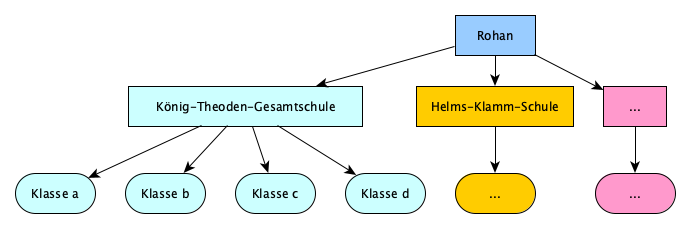
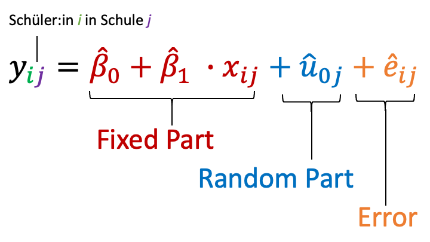

```{r setup, include=FALSE}
knitr::opts_chunk$set(echo = FALSE, message=FALSE, warning=FALSE, fig.align="center")
```

```{r message=FALSE, warning=FALSE}
# Pakete für diesen Artikel
library(tidyverse)
library(nlme)
```

```{r sim, include=FALSE}
overall_seed <- 1234
set.seed(overall_seed)

schools <- list()
school_intercept <- sample(-15:15, size=8, replace=TRUE)
realm_intercept <- c(-15, 10)

schools$rohan <- list(
  names = c(
  "König-Theoden-Gesamtschule",
  "Helms-Klamm-Schule",
  "Schildmaid-Eowyn-Schule",
  "Königliche Schule zu Edoras"
  ), 
  mndfl = c(T, T, T, F),
  realmint = realm_intercept[1],
  schoolint = school_intercept[1:4]
)

schools$gondor <- list(
  names = c(
  "Gandalf-Gymnasium",
  "Wirtschaftsgymnasium Osgiliath",
  "Integrierte Gesamtschule Minas Tirith",
  "Arwen-Abendstern-Schule"
  ),
  mndfl = c(T, F, F, F),
  realmint = realm_intercept[2],
  schoolint = school_intercept[5:8]
)

skills <- function(realm, school, mindfulness, seed=1234) {
  set.seed(seed)
  m <- ifelse(mindfulness == TRUE, 1, 0)
  base <- rnorm(n=20 + sample(-4:4, size=1), m = 30, sd = 4) %>% round(1)
  read <- base + realm + school + 5*m
  return(read)
  }

classes = c("a", "b", "c", "d")
classes_list <- list()
i <- 0
for (r in c("rohan", "gondor")) {
  realmschools <- schools[[r]]
  # print(glue::glue("working on {r}\n"))
  
  for (s_index in seq_along(realmschools$names)) {
    # print(glue::glue("working on "))
    
    for (c in seq_along(classes)) {
      i <- i + 1
      classes_list[[i]] <- tibble(
        realm = r,
        school = realmschools$names[[s_index]],
        mindfulness = realmschools$mndfl[c],
        class = classes[c],
        
        reading_skill = skills(
          realm = realmschools$realmint,
          school = realmschools$schoolint[[s_index]],
          mindfulness = realmschools$mndfl[[c]],
          seed = overall_seed
        )
      )
      overall_seed <- overall_seed + 1
    }
  }
}

data <- bind_rows(classes_list) %>% mutate(pupil_id = 1:n())

write_csv(data, "files/schools_middle_earth.csv")
```

```{r models}
m1 <- lm(reading_skill ~ mindfulness, data = data)
m1_sum <- m1 %>% summary()
m2_ci <- m1 %>% confint()

m2 <- lme(reading_skill ~ mindfulness, random=~1|school, data = data)
m2_sum <- m2 %>% summary()
m2_ci <- m2 %>% intervals()
```

```{r plots}
plot <- data %>% 
  mutate(mindfulness = factor(mindfulness, 
                              levels = c(FALSE, TRUE), 
                              labels = c("Nein", "Ja"))) %>% 
  ggplot() + aes(x = mindfulness, y = reading_skill)

bars <- plot +
  stat_summary(fun = mean, geom = "bar", aes(fill = mindfulness), alpha = 0.8) +
  stat_summary(fun.data = "mean_sdl", fun.args = list(mult = 1), 
               geom = "pointrange") +
  
  stat_summary(fun.data = "mean_cl_boot", 
               geom = "errorbar", linetype = "dotted", color = "grey20") +
  ylim(0, 60) +
  labs(x = "Achtsamkeitsübung", y = "Lesefertigkeit Ende der 9. Klasse",
       title="Barplot",
       subtitle="Balkendiagramme sind sehr\nMittelwerts-fixiert.") +
  scale_fill_discrete(guide = F) +
  theme_classic() +
  NULL

violins <- plot +
  geom_jitter(alpha = 0.1) +
  geom_violin(aes(fill = mindfulness), alpha = 0.8) +
  stat_summary(fun.data = "mean_sdl", fun.args = list(mult = 1), 
               geom = "pointrange") +
  
  stat_summary(fun.data = "mean_cl_boot", 
               geom = "errorbar", linetype = "dotted", color = "grey20") +
  ylim(0, 60) +
  labs(x = "Achtsamkeitsübung", y = "Lesefertigkeit Ende der 9. Klasse",
       title="Violin plot",
       subtitle="Violin-Plots haben den Vorteil, dass sie die\nVerteilung der Daten abbilden.") +
  scale_fill_discrete(guide = F) +
  theme_classic() +
  NULL

# show_schools <- c(schools$rohan$names[c(1,3)], schools$gondor$names[1])
show_schools <- c(schools$rohan$names, schools$gondor$names)

school_means <- data %>% 
  filter(school %in% show_schools) %>% 
  group_by(school) %>% 
  summarise(reading_skill = mean(reading_skill)) %>% 
  ungroup()

panels <- data %>% 
  filter(school %in% show_schools) %>% 
  mutate(mindfulness = factor(mindfulness, 
                              levels = c(FALSE, TRUE), 
                              labels = c("Nein", "Ja"))) %>% 
  ggplot() + aes(x = mindfulness, y = reading_skill) +
  geom_jitter(alpha = 0.1) +
  geom_violin(aes(fill = mindfulness), alpha = 0.8) +
  geom_smooth(method="lm", se=F, aes(group=1), color="black") +
  geom_hline(aes(yintercept = reading_skill), data = school_means, linetype = "dotted") +
  facet_wrap(~school) +
  labs(x = "Achtsamkeitsübung", y = "Lesefertigkeit Ende der 9. Klasse") +
  ylim(0, 60) +
  scale_fill_discrete(guide = F) +
  theme_classic() +
  NULL
```

## Was sind Multilevel Modelle?

{style="float: right; margin: 1rem;" width="300"}

Um Multilevel-Modelle zu Erklärung holen wir in diesem Skript anhand eines Beispiels etwas aus. Stellen wir uns einmal folgende Situation vor: Sie haben den Auftrag, im Rahmen eines pädagogisch-psychologischen Projektes die Effektivität von Achtsamkeitsübungen in der Praxis zu untersuchen. Die Theorie: Durch eine kurze Achtsamkeitsübung am Beginn einer Schulstunde sinkt die Unruhe in der Klasse, was zu einem besseren Lernklima führt. Bevor Sie enorme Ressourcen aufwenden, um die Frage in einem groß angelegten Feld-Experiment zu untersuchen, werten Sie vorhandene Daten aus.

## Die Story: Schulen in Mittelerde

{style="float: left; margin: 1rem;" width="300"}Und Sie haben Glück: Es gibt einen sehr ergiebigen Datensatz über acht Schulen in Mittelerde, die sie nutzen können. Einige Klassenlehrer, sowohl in Gondor, als auch in Rohan, haben sich von den Elben überzeugen lassen, routinemäßig zu Beginn jeder Unterrichtsstunde eine Achtsamkeitsmeditation durchzuführen. Im Datensatz finden Sie Informationen zur Lesefertigkeit der Schüler:innen am Ende der 9. Klasse und Informationen über die Schule. Hier ein Blick in die Daten:

```{r}
data %>% 
  select(pupil_id, realm, school, mindfulness, class, reading_skill) %>% 
  sample_n(5) %>% 
  knitr::kable()
```

```{r eval=FALSE, include=FALSE}
data %>% 
  group_by(school, class, mindfulness) %>% 
  summarize(n = n()) %>% 
  ungroup() %>% 
  group_by(mindfulness) %>% 
  summarise(n = n())

data %>% 
  group_by(school, class) %>% 
  summarize(n = n()) %>% 
  ungroup() %>% 
  summarize(m = mean(n), sd = sd(n), min = min(n), max = max(n))
```

Weitere Eckdaten:

-   Wir haben Daten von 672 Schüler:innen aus acht Schulen

-   Je vier Schulen liegen in Rohan und vier in Gondor

-   Pro Schule gibt es 4 Klassen, die durchschnittliche Klassengröße beträgt 20 Schüler:innen (Minimum: 16, Maximum: 24, SD: 2.35)

-   Im Datensatz gibt es je 16 Klassen, die Achtsamkeitsübungen praktizieren und nicht praktizieren.

-   Die Lesefertigkeit wird auf einer Skala von 0 bis 60 Punkten gemessen.

### Die Analyse

Schauen wir uns nun eine einfache Analyse der Daten an. Wir rechnen folgende Regression:

$$
y_i = \hat{\beta}_0 + \hat{\beta}_1 \cdot x_i + \hat{\epsilon}_i
$$

Dabei ist

-   $y_i$ die Lesefertigkeit von Schüler:in \$i\$,

-   $x_i$ ein Indikator dasfür, ob Schüler:in $i$ in einer Klasse ist, in der Achtsamkeitsübungen durchgeführt werden (0 = Nein, 1 = Ja),

-   und $\hat{\beta}_1$ der geschätzte mittlere Unterschied in der Lesefertigkeit zwischen Schüler:innen, die Achtsamkeitsübungen erfahren und solchen, die keine Achtsamkeitsübungen erfahren.

Hier der R-Output zur Regression:

```{r echo=FALSE}
m1_sum
```

Wir sehen, dass $\hat{\beta}_1$ auf ca. -2.3 geschätzt wird, und dass dieses Ergebnis unter der Nullhypothese $\hat{\beta}_1 = 0$ nur mit einer Wahrscheinlichkeit von p \< .001 auftreten würde. Unsere Schätzung aufgrund dieser Analyse lautet also, dass Achtsamkeitsübungen mit einer um ca. 2.3 Punkte *schlechteren* Lesefertigkeit zusammenhängen. Ein Plot scheint diesen Eindruck zu bestätigen:

```{r overall, fig.cap="**Abbildung**: Mittlere Lesefertigkeiten in Schulklassen, in denen Achtsamkeitsübungen durchgeführt oder nicht durchgeführt werden. Die Plots a) und b) zeigen die gleichen Daten, einmal als Balkendiagramm und einmal als Violin-Plot mit Rohdaten im Hintergrund (jeder Datenpunkt bezieht sich auf eine:n Schüler:in). Fehlerbalken zeigen plus/minus eine Standardabweichung in der Lesefertigkeit um den Mittelwert.\nGepunktete Linien zeigen 95%-Konfidenzintervalle für die Mittelwerte."}
ggpubr::ggarrange(bars, violins, labels="auto")
```

### Der Haken

Der Haken ist: Wir haben zwar eine große Stichprobe und für sich genommen tolle Daten, doch es handelt sich hier um **kein experimentelles Design**. Das heißt genauer:

-   Wir vergleichen zwar gewissermaßen eine Kontroll- und eine Experimentalgruppe miteinander, aber diese **Gruppen wurden nicht zufällig eingeteilt**. Wir haben stattdessen Daten genommen, die uns ohnehin vorlagen. Damit besteht ein großes Risiko für [Konfundierung](<https://ctreffe.github.io/r-space/konfundierung.html>).

-   In unserem Datensatz haben wir zusätzlichen Grund, Verzerrungen zu vermuten, denn unsere Beobachtungen sind **nicht unabhängig voneinander**: Unser Datensatz lässt sich systematisch in zusammengehörige Untergruppen einteilen (siehe Abbildung unten). Schüler:innen aus der gleichen Klasse oder Schule sind sich vermutlich untereinander ähnlicher, als Schüler:innen aus verschiedenen Schulen oder gar verschiedenen Reichen. Die Unabhängigkeit *aller* Datenpunkte ist allerdings eine zentrale Annahme für die Gültigkeit unserer statistischen Analyse.



### Warum ist der Haken wichtig?

Das wird am besten deutlich, wenn wir eine ausgefeiltere Analyse anwenden, mit der wir die Beziehungen innerhalb unseres Datensatzes explizit berücksichtigen. In einer Regressionsgleichung, in der wir Korrelationen innerhalb von Schulen berücksichtigen wollen, sieht das ungefähr so aus:

{style="text-align: center;" width="400"}

Die Formel zeigt eine *Multilevel-Regression*. Dabei ist für uns insbesondere der *fixed effect* $\hat{\beta}_1$ interessant; das ist praktisch die gleiche Größe wie in der normalen Regression. Der Unterschied ist, dass wir durch den *random effect* \$\\hat{u}\_{0j}\$ die Unterschiede zwischen den Schulen explizit berücksichtigen und aus unserer Schätzung für $\hat{\beta}_1$ "herausrechnen" können. Schauen wir uns zu dieser Analyse nun einen Plot an, so sehen wir: In jeder einzelnen Schule für sich genommen sind die Achtsamkeitsübungen tatsächlich mit *besseren* Leseleistungen assoziiert.

```{r panels, message=FALSE, fig.height=10, fig.cap="**Abbildung**: Violin-Plot der Lesefertigkeit in Klassen mit und ohne Achtsamkeitsübungen. Gepunktete Linie zeigt den Schul-Mittelwert."}
panels
```

Die Analyse per Multilevel-Regression bestätigt den Eindruck aus den Plots: Wir bekommen eine Schätzung von $\hat{\beta}_1$ = 4.7, d.h. im Mittel sind Achtsamkeitsübungen mit einer um etwa 4.7 Punkte *besseren* Lesefähigkeit assoziiert.

<div class="alert alert-info">

Wir zeigen an dieser Stelle bewusst nicht die Details der Spezifikation. Ziel dieses Skriptes ist, auf grober Ebene das *Konzept* von Multilevel-Analysen zu verdeutlichen. Die praktische Durchführung wird bspw. in *Field (2012)* besprochen.

</div>

```{r}
m2_sum
```

Jetzt noch einmal eingeordnet in unsere Perspektiven:

**Wissenschaftliche Perspektive** \| Die wissenschaftliche Perspektive stellt den Erkenntnisgewinn in den Mittelpunkt: Stimmt unsere Theorie? Wie groß und wie zuverlässig ist der Effekt? Welche Faktoren beeinflussen das Ergebnis?

-   Wenn wir Daten mit hierarchischen Strukturen (z.B. Schüler in Klassen in Schulen in Ländern, ...) analysieren, dann wird ggf. die Annahme unabhängiger Beobachtungen verletzt. Diese Annahme ist wichtig für klassische statistischer Verfahren wie t-Test, ANOVA und Regression (*t-Test und ANOVA sind nur andere Darstellungen von Regressionen*).

-   Wenn die Unabhängigkeitsannahme verletzt wird, *kann* es sein, dass die Schlussfolgerungen statistischer Analysen *falsch* sind. Genau genommen ist eine solche Analyse schlicht **unbrauchbar**, um Hypothesen zu testen.

**Praktiker-Perspektive** \| Die praktische Perspektive stellt die Nützlichkeit einer aus der Forschung abgeleiteten Intervention in den Mittelpunkt: Sollten wir die Intervention einsetzen?

-   Wenn die Datenanalyse einer empirischen Studie nicht geeignet ist, die vorgestellte Theorie oder Hypothese angemessen zu testen, dann bietet sie keine gute Grundlage für praktische Entscheidungen.

-   Solche Analysen sollten deshalb nicht als einzige Evidenz zur Bedrüngung von praktischen Entscheidungen verwendet werden. Vielmehr sollten sich Praktiker als Risikomanager:innen verstehen und die theoretische Plausibilität und empirische Evidenz ganzheitlich betrachten. Auf dieser Basis können sie verschiedene Szenarien abwägen und eine bestmöglich fundierte Entscheidung treffen.

-   Dahingehend treffen die gleichen, detaillierteren Überlegungen zu, die wir in unserem Artikel zu [Konfundierung]([https://ctreffe.github.io/r-space/konfundierung.html)](https://ctreffe.github.io/r-space/konfundierung.html)) (siehe "Warum ist der Haken wichtig?") geschildert haben.

<div class="alert alert-warning">

**Ein paar Hinweise zu Multilevel-Modellen**

-   Je nach Versuchsdesign kann es auch in randomisierten Experimenten durchaus sein, dass hierarchische Daten entstehen, bspw. wenn Versuchspersonen in Untergruppen eingeteilt werden. Das sollte bei der Analyse berücksichtigt werden!

-   Es gibt keine objektive, immer zutreffende Regel dafür, um zu entscheiden, welche Effekt als *fixed* und welche als *random* Effekte modelliert werden. Hier müssen theoriegeleitete Entscheidungen getroffen werden. Die Leitfrage, um diese Entscheidung zu treffen ist: „Welcher Effekt ist von wissenschaftlichem Interesse für mich?" Das ist tendenziell ein *fixed* Effekt. Auch die umgekehrte Frage ist hilfreich: „Welcher Effekt hat möglicherweise einen verzerrenden Einfluss, den ich 'herausrechnen' möchte?" Das ist tendenziell ein *random* Effekt.

-   Es kann durchaus sein, dass Daten eine hierarchische Struktur ähnlich der hier vorgestellten aufweisen, ohne dass eine Modellierung in einem Multilevel-Modell notwendig ist. Dafür kann z.B. die *Intraclass Correlation (ICC)* berechnet werden; eine Korrelation, die angibt, wie ähnlich sich Beobachtungen *innerhalb einer Gruppe* sind. Eine hohe ICC deutet darauf hin, dass eine Multilevel-Analyse sinnvoll ist. Für Details verweisen wir auf Field (2012).

</div>

## Quellen und Links

-   *Field (2012) Discovering Statistics Using R, Kapitel 19: Multilevel linear models. SAGE Publication*
